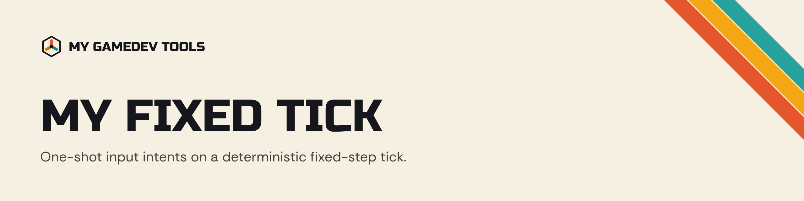

<p align="center">
  <picture>
    <source media="(prefers-color-scheme: dark)" srcset="docs/img/banner-dark.png">
    
  </picture>
</p>

<p align="center">
  
  <a href="LICENSE"></a>
</p>

## ⚡ Overview

**My Fixed Tick** is a Unity package for a **deterministic fixed-step tick** and a **one-shot input intent** bound to a single step. In a quick example:

```cs
// A writer, wherever input comes from.
input.Attack.Set(MyFixedTick.Current);

// A reader, later in the same step.
if (input.Attack.TryConsume(tick))
    Attack();
```

Instead of:

```cs
bool _attackPressed;

void Update()
{
    if (Keyboard.current.jKey.wasPressedThisFrame)
        _attackPressed = true;
}

void FixedUpdate()
{
    if (_attackPressed)
    {
        _attackPressed = false;
        Attack();
    }
}
```

That flag stays set until something clears it, so a paused or reloaded game delivers a stale press, a second reader never sees it, and the whole thing depends on a script execution order nobody wrote down. An intent is valid for exactly one fixed simulation step and expires by arithmetic: nothing clears it, nothing can consume it twice, and nothing goes stale.

The point is the input surface between writers and readers. Put a project's input vocabulary in a plain type, have every reader read only that, and a character driven by a keyboard and the same character driven by a script run the identical code. Every mechanic written for a player works for an agent the day it ships, because there is no second path to drift out of sync.

## 🚀 Features

- **One-Shot Input Intents**: `FixedInputEvent` is valid for one fixed step, with a peek/consume split and per-read buffering windows. Two unmanaged fields, so it works as an `IComponentData` and from Burst-compiled code.
- **A Tick That Installs Itself**: The default source installs into the `PlayerLoop` at the end of the fixed phase, so it needs no scene object and no script execution order, and physics callbacks observe the step they are actually in.
- **Swappable Clocks**: `ITickSource` is an interface, so a project can run off a clock it already owns.
- **Diagnostics That Name The Problem**: Development builds report an intent nobody consumed and two writers that fought over one field, instead of a character that mysteriously ignores input.
- **Optional Entities Support**: Compiled only when the Entities package is present.
- **A Sample To Learn From**: One character driven by a keyboard and by a scripted agent through the same input surface, in a MonoBehaviour scene and an Entities scene, with an overlay that shows every intent step by step and lets you cap the frame rate and scale time, so you can prove frame independence rather than assume it.

## 📦 Installation

You can install the package via **Tarball** or **Git**. Either way it needs Unity 6000.0 or newer, and no other packages.

#### Tarball (UPM Signed)

1. Choose the [release](https://github.com/mygamedevtools/fixed-input/releases) you want to install and download the `com.mygamedevtools.fixed-input-<release>.tgz` asset.
2. Open `Window/Package Manager`.
3. Click <kbd>+</kbd>.
4. Select `Install package from tarball...`.
5. Select the `com.mygamedevtools.fixed-input-<release>.tgz` file you downloaded.

#### Git (UPM Unsigned)

1. Open `Window/Package Manager`.
2. Click <kbd>+</kbd>.
3. Select `Install package from git URL...`.
4. Paste `https://github.com/mygamedevtools/fixed-input.git#upm` into url.
5. Click `Add`.

To pin a version, use its tag instead of the branch, e.g. `https://github.com/mygamedevtools/fixed-input.git#upm/0.2.0`.

> [!NOTE]
> The sample, including its 3D Game Kit art, is not imported with the package. Import **Input Surface Reference** from the package's `Samples` tab in the Package Manager when you want it.

## 📚 Documentation

The detailed documentation lives in the [package README](Packages/com.mygamedevtools.fixed-input/README.md): the [contract](Packages/com.mygamedevtools.fixed-input/README.md#the-contract), what [the tick](Packages/com.mygamedevtools.fixed-input/README.md#the-tick) actually means, where [latency](Packages/com.mygamedevtools.fixed-input/README.md#latency-and-which-parts-of-it-you-can-remove) comes from and which parts of it you can remove, the [diagnostics](Packages/com.mygamedevtools.fixed-input/README.md#diagnostics), and the [sample](Packages/com.mygamedevtools.fixed-input/README.md#samples).

## 🤝 Contributing

We welcome contributions! Please check our [contribution guidelines](./CONTRIBUTING.md).

## 📄 License

This project is licensed under the [MIT License](./LICENSE).

The sample's character and environment art is from Unity's 3D Game Kit and is licensed separately, under the Unity Companion License. See [3D Game Kit License.md](<Packages/com.mygamedevtools.fixed-input/Samples/InputSurfaceReference/3D Game Kit License.md>) and [Third Party Notices.md](<Packages/com.mygamedevtools.fixed-input/Third Party Notices.md>).
